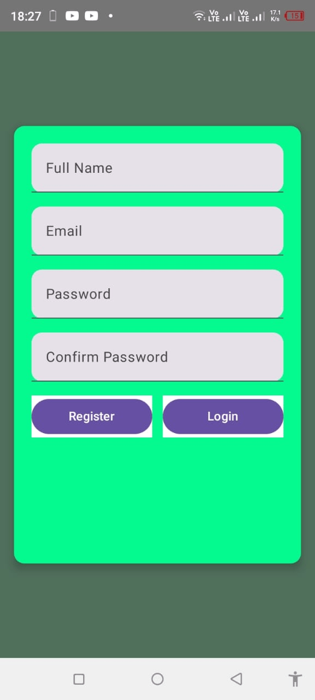
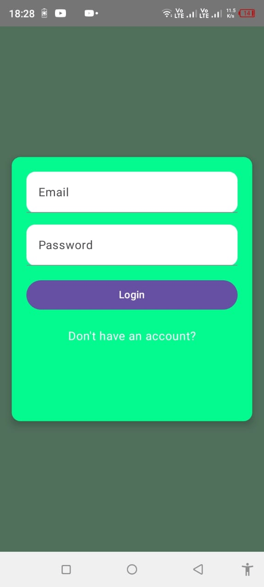

# ✅ Firebase To-Do App (Jetpack Compose)

A modern and responsive **To-Do List Android App** built using **Jetpack Compose** and integrated with **Firebase Authentication** and **Cloud Firestore**. This app is part of my internship task at High Tech Software House.

---

## 🚀 Features

- 🔐 User Registration & Login (Firebase Auth)
- ✅ Create, Edit, Delete To-Do Tasks (Firestore)
- 📦 Real-time data sync with Firebase
- 🧠 Built using Jetpack Compose + MVVM
- 💚 Beautiful modern UI (Material 3 + Compose)

---

## 🛠️ Tech Stack

| Tech | Use |
|------|-----|
| Kotlin | Language |
| Jetpack Compose | UI Toolkit |
| Firebase Auth | User authentication |
| Firestore | Real-time database |
| MVVM | Architecture |
| Material 3 | UI Design System |

---

## 📱 Screenshots

| Register | Login | Dashboard |
|---------|--------|------------|
|  |  |  |

---

## 📦 How to Run

1. Clone this repo  
   ```bash
   git clone https://github.com/your-username/your-repo-name.git
Open in Android Studio

Connect your Firebase project:

Add google-services.json in app/ folder.

Enable Email/Password in Firebase Auth

Set up Firestore (no rules change needed for development)

Run on emulator or real device

📜 License
This project is under the MIT License. Feel free to use, fork, or improve it.

🙋‍♂️ Developed By
Zafar Ali
📍 Android Developer | Jetpack Compose | Firebase
📫 [LinkedIn](https://www.linkedin.com/in/zafar-android-dev/) • [GitHub](https://github.com/zafar-Alee/)

